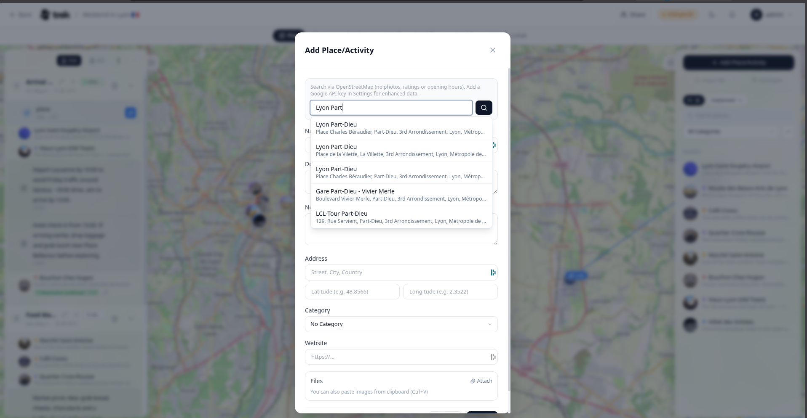

# Places and Search

Places are the building blocks of your trip. You can add them by searching, pasting a URL, entering coordinates, or importing a file.

## Adding a place

Click **+ Add Place** at the top of the Places sidebar to open the Place form. You can also **right-click anywhere on the map** to create a place at that exact location — the address is reverse-geocoded and pre-filled automatically.

## Searching for a place

Type in the search box at the top of the form. After 2 or more characters, with a 300 ms debounce, suggestions appear in a dropdown.

- Use **↑ / ↓** to navigate results, **Enter** to select, **Esc** to dismiss.
- Search results are biased toward the geographic center of your existing trip places. When those places span more than ~500 km, the bias is skipped.

### With a Google Maps API key

> **Admin:** A Google Maps API key is configured in [User-Settings](User-Settings).

When a key is present, the autocomplete uses the Google Places API, which can return ratings, opening hours, photos, and phone numbers from Google's database.

### Without a Google Maps API key

TREK falls back to OpenStreetMap (Nominatim) automatically — no API key needed. A notice appears above the search box explaining that OpenStreetMap is in use and that photos, ratings, and opening hours are unavailable. Results include name, address, and coordinates.

## Pasting a Google Maps URL

Paste a `maps.app.goo.gl/…`, `goo.gl/maps/…`, or `maps.google.*/…` URL directly into the search box and press the search button. TREK resolves it server-side and populates the name, address, and coordinates.

## Entering coordinates manually

Type or paste a `lat, lng` pair (e.g. `48.8566, 2.3522`) into the **Latitude** field. TREK detects the comma-separated pair and fills both coordinate fields at once.

## Place fields

<!-- TODO: screenshot: Place form with all fields visible -->

| Field | Notes |
|---|---|
| Name | Required |
| Description | Free text |
| Notes | Free text, max 2 000 characters |
| Address | Free text |
| Latitude / Longitude | Decimal degrees |
| Category | Pick an existing category or type a new name to create one inline (default color `#6366f1`, icon `MapPin`) |
| Start time / End time | Shown only when editing an existing place |
| Website | URL |
| File attachments | Images or PDFs — click the Paperclip icon or paste from the clipboard |

Two inline warnings are shown when editing times: one if the end time is set to a value before or equal to the start time, and one if the times overlap with another place already assigned to the same day.

## Importing multiple places

Drag a `.gpx`, `.kml`, or `.kmz` file onto the Places sidebar to import all waypoints or features at once. You can also import a saved-list share URL using the **Import list** button in the sidebar header — both Google Maps and Naver Maps list URLs are supported.

> **Admin:** Google Maps API key is set in [User-Settings](User-Settings). Without it, OSM search is used automatically.

**See also:** [Day-Plans-and-Notes](Day-Plans-and-Notes) · [Map-Features](Map-Features) · [Tags-and-Categories](Tags-and-Categories)
